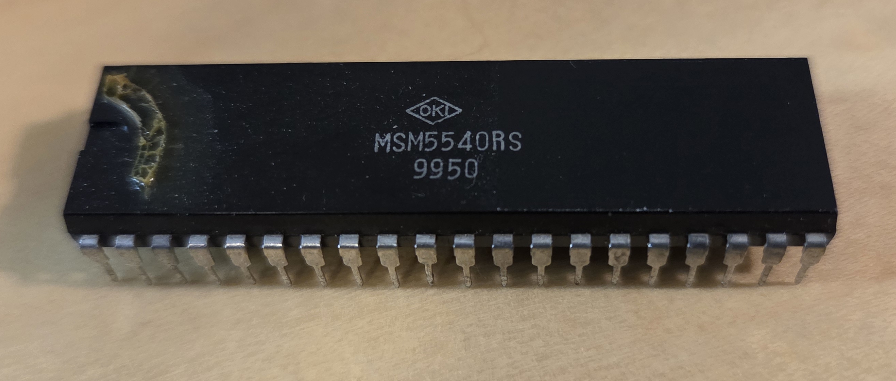
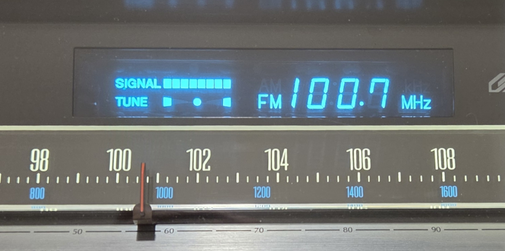
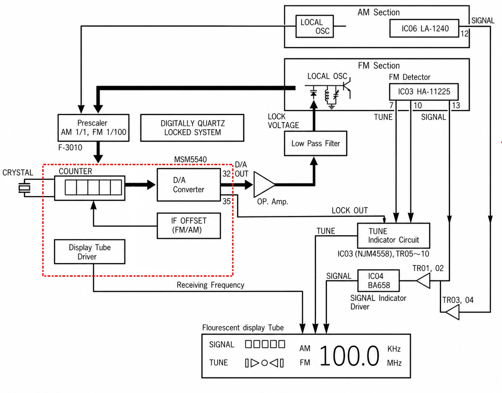
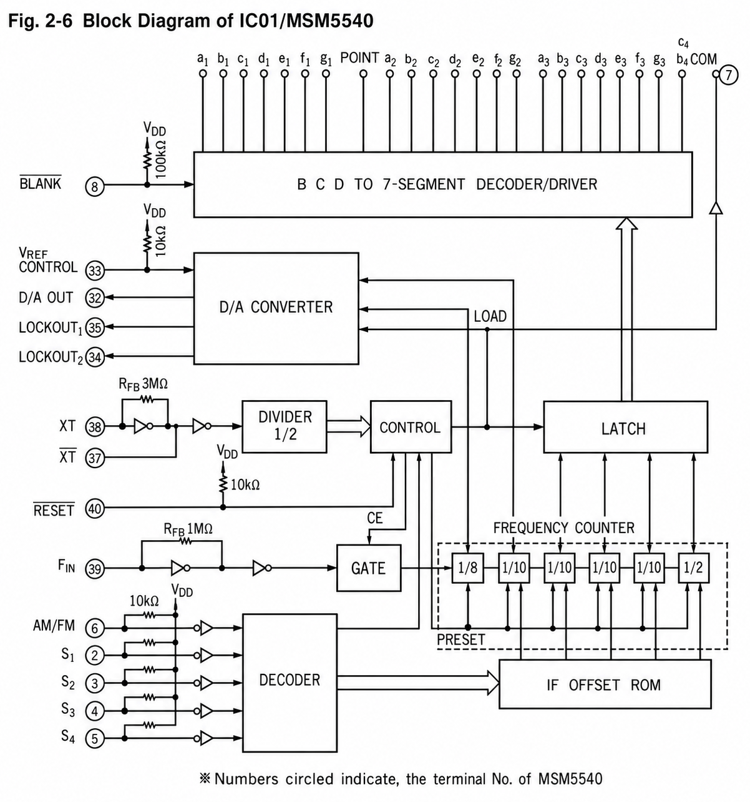
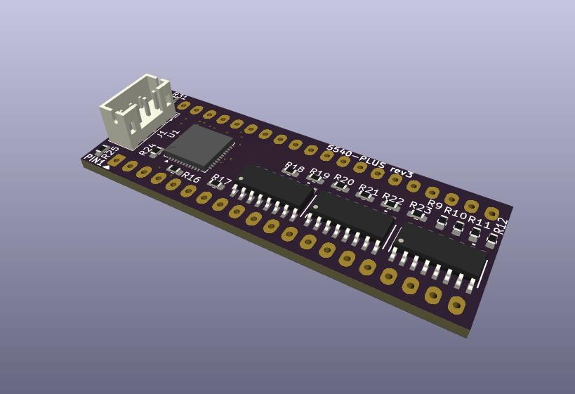
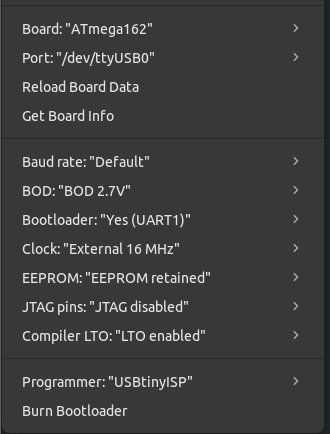

# 5540-PLUS Project

## Table of Contents
- [Introduction](#introduction)
- [Implementation](#implementation)
- [Lack of Datasheet](#lack-of-datasheet)
	- [Overview of Function](#overview-of-function)
	- [Block Diagram](#block-diagram)
- [5540+ Schematic](#5540+-schematic)
- [PCB](#pcb)
- [Firmware](#firmware)
- [Arduino Compatible](#arduino-compatible)
- [Testing](#testing)
	- [Video](#video)
- [Lessons Learned](#lessons-learned)

## Introduction

The 5540+ Project was started to create a fully compatible replacement for the obsolete IC OKI MSM5540. This DIP-40 chip is used in certain 1970's and early 1980's tuners and receivers, mostly from Sansui. When this IC fails, the fluorescent display does not show the correct frequency, segments are permanently ON or OFF, and the quartz lock functions erratically or not at all.

 The original IC implements 3 functions for the tuner:
- Drive the Vacuum Fluorescent display segments to display the current tuned frequency
- Control a digital signal indicating when the frequency is within the "Lock Range" for Quartz lock
- Control an analog voltage that is issued to the local oscillator to keep the tuned frequency centered within the Lock Range

Original Integrated circuit:

## Implementation

The goal was to be able to create a small PCB that could slot into the position of the original IC (with or without a socket) that would replicate all the functionality of the original IC using off the shelf parts (no ASIC, etc). This would need a modern microcontroller to replicate the logic portion of the IC, and off the shelf transistor arrays to drive the segments. The Signal Strength indicator on the VFD is driven by separate logic and not the MSM5540.

When choosing a microcontroller we needed to consider the following:
- 5V compliant I/O (to eliminate logic level conversion on the PCB)
- can properly measure frequency within the tolerance we need
- can drive a PWM signal for an analog tuning assist voltage needed for Quartz locking
- has enough I/O to implement all the functions of the chip without additional ICs for port expansion, etc.
- can be easily programmed and tested without needing to use assembly language

While modern microcontrollers like RP2350 were tempting based on the functionality, ease of use and pin count, ultimately they would have cost more due to logic level conversion, power voltage conversion, and other challenges. 

In the end, the Atmel ATmega162 from Microchip was chosen for this task. This microcontroller has 35 I/O pins, peripherals for PWM and frequency counting, can be powered directly from 5V and has 5V inputs and outputs, and can be serially programmed with the proper bootloader installed.

This microcontroller is offered in several variants:
- DIP 40 
- 44-TQFP (10x10)
- 44-VQFN (7x7, 0.5mm) --> ATMEGA162-16MU

The ATMEGA162-16MU VQFN includes 16KB flash, 1KB SRAM and a 512 byte EEPROM (which will be handy for storing the lookup tables needed to convert the digits to 7 segment display). While these specs seem meager compared to many modern high power microcontrollers, they should work perfectly for our needs and operate at low power that is comparable to the original IC. This package fits well on a PCB that is sized to the original DIP-40 form factor.

## Lack of Datasheet

There is no known datasheet currently available for this IC, so all functions have to be reverse engineered from currently available information and testing.

The *best* resource so far has been scans of the Sansui TU-719 service manual found online. This manual goes into some detail about the internal designs of the MSM5540 IC and how it counts pulses and displays the frequency.

In our case we are not trying to duplicate the exact internal process of the original IC, but instead produce a result using a pulse counting routine in the microcontroller.

Here is an overview from the service manual of how this IC is used in the tuner:

### Overview of Function
The general workflow for the replacement circuit will be the following:

1. Evaluate are we in FM or AM?
2. check what is the IF offset (this is set with diodes and jumpers on the digital display board)
3. Read the current frequency for ~80ms
4. do the math to subtract the IF offset to reveal the tuned frequency
5. Output the proper segments to the display to show the frequency
6. evaluate whether we are in the Lock range and set Lock1/Lock2 outputs
7. evaluate the analog voltage correction needed on the D/A Out line and generate the proper PWM signal to achieve the analog voltage needed.
8. Repeat

This cycle should happen around 10x per second, to be similar to the original IC.

| AM/FM (6) | S1 (2) | S2 (3) | S3 (4) | S4 (5) | IF Frequency | IF Offset ROM Value |
|-----------|------|------|------|------|-------------:|--------------------:|
| H | H | H | H | X | 454 | -453.5 |
| H | L | H | H | X | 455 | -454.5 |
| H | H | L | H | X | 456 | -455.5 |
| H | L | L | H | X | 449 | -448.5 |
| H | H | H | L | X | 450 | -449.5 |
| H | L | H | L | X | 451 | -450.5 |
| L | H | H | H | H | 10.62 | +10.67 |
| L | L | H | H | H | 10.64 | +10.69 |
| L | H | L | H | H | 10.66 | +10.71 |
| L | L | L | H | H | 10.68 | +10.73 |
| L | H | H | L | H | 10.70 | +10.75 |
| L | L | H | L | H | 10.72 | +10.77 |
| L | H | L | L | H | 10.74 | +10.79 |
| L | L | L | L | H | 10.76 | +10.81 |
| L | H | H | H | L | 10.62 | -10.57 |
| L | L | H | H | L | 10.64 | -10.59 |
| L | H | L | H | L | 10.66 | -10.61 |
| L | L | L | H | L | 10.68 | -10.63 |
| L | H | H | L | L | 10.70 | -10.65 |
| L | L | H | L | L | 10.72 | -10.67 |
| L | H | L | L | L | 10.74 | -10.69 |
| L | L | L | L | L | 10.76 | -10.71 |

- numbers in parenthesis indicate the terminal numbers of the MSM5540.
- S4 LOW indicates the upper heterodyne.(subtract this)

- S4 HIGH indicates the lower heterodyne. (add this)
- If the IF OFFSET ROM Value does not change in either H or L level, use the default value.

The offset ROM value would have been pre-loaded into the Counter in the MSM5540 before each frequency counting time period. In our case we will use C math functions to adjust the offset in the microcontroller.

The Sansui receivers and tuners that I have reviewed all use Upper Heterodyne reception, as was common in the late 1970's for most tuners. The Lower Heterodyne function of the MSM5540 will still be implemented per the original IC specification, but it is not likely to be used, as all the Sansui tuners and receivers I have checked have the S4 pin tied to GND.

### Block Diagram
The Sansui manual shows us a Block Diagram of the internals of the MSM5540:

We are not trying to replicate the exact gate and control logic as the original IC, but rather we can use the modern microcontroller to do the math in a simpler way.

This block diagram does provide plenty of information, including the values of the internal pull-up resistors for the IF offser, AM/FM and VREF control lines.

There are 2 LOCKOUT lines, which are high signal when the receiving frequency is within the lock range of the receiving frequency.
- The LOCKOUT 1 seems to follow the indicated 40kHz (+/-20kHZ) range specified in the diagrams.
- The LOCKOUT 2 is not used on Sansui receivers and seems to be an Inverse of the LOCKOUT1 line with some additiona logic. This is currently not implemented on the 5540-PLUS but the line is hooked up to the microcontroller so it could be added in the future if some receiver is found that uses it.

This chart shows the intended behavior: (Chart assumes 10.72MHz IF)

The harder function to implement is the "D/A OUT" function which is an analog voltage emitted to the chip and fed through a differential amplifier to a VCO to  "nudge" the tuned frequncy if we are drifting slightly from the center of the LOCK range.

This is made using a small RC circuit to smooth the PWM signal to an analog voltage.

External pullup resistors are not used on many of the input lines as it was determined that the internal ~30-50K pullups in the ATMega were sufficient to reduce component count and ensure enough space on the PCB.

## 5540+ Schematic

- Schematic was made in KiCad. 
- The UART for debugging and firmware loading is broken out to a 4 pin JST-PH connector.
- The connection to the existing 6.5536MHz Crystal  was not used, and this comes with an onboard 16MHz crystal oscillator
- See [Schematic](./Schematics/5540-PLUS-rev3.pdf)

## PCB

PCB was made in KiCad. There are mostly surface mount components and it is a double sided board. 0603 resistors were chosen, mainly due to that seems to be the smallest thing I could solder by hand while making up prototype boards.

The prototypes are assembled by hand but the intention is it could be sent off to fab.

## Firmware

### Arduino Compatible
I am not a programmer and I certainly have no intention of writing assembly code for this. I chose to program using the Arduino environment due to easy C programming and easy code changes with the appropriate bootloader.

The MajorCore project includes compatible libraries and a bootloader for interacting with an ATMega162. 

We burn the bootloader using a Sparkfun TINYISP programmer attached to the pads on the bottom of the board. This only needs to be done once, and then the code can be updated through the serial UART.

After going through an initial startup to set port direction and other chip functions, the firmware goes through a simple loop doing the following:

1. Run the pulse counter to sample the current frequency.
2. add the IF offset (this is an inverse of the IF as set by the Sx inputs).
3. Separate out the "displayed" frequency from the "sub" frequency (for FM this is the 10KHz and 1KHz digits).
4. doing an average with the last subfrequency for a smoother operation.
5. Emit the LOCKOUT_1 value if it is within 30-70.
6. check the VREF_CTL input and emit a PWM for the analog DA_OUT voltage, if not, emit a 50%PWM for 2.5V.
7. Check if the frequency is way too high or low to be possible, display 000.
8. Output the segments to the VFD drive transistors to show the "displayed" frequency. Also output the FM/./MHz at this time.
9. Repeat forever.

## Testing
This circuit was tested on a T-80 tuner with an F-3000 display board. I also have a parts F-3220 board but have been unable to test with that as all the connections are different. It should work in Europe and other areas that lock into frequencies with even numbered 100KHz values like 98.8, etc because like the original it emits lock signal on every 100Khz. But this has not been tested.

|Board|Status | Receiver/Tuner Models |
|---|---|---|
|F-3000| Tested - Working | G-4700, G-5700, G6700, G7700, T-80, TU-719 |
|F-3220| Not Tested| G-4700, maybe others|
|F-3088|Not Tested| G-8700DB, G-9700|
|F-2871|Not Tested | TU-919|

Does it work? Yes, at least on an F-3000 board it seems to work comparable to the original IC. I am looking for more options to test this in other models. I suspect it will be fine in F-3220 and F-3088 since its hooked up the same way per schematics. The TU-919 uses the IC to drive individual LEDs and that is very different.

### Video
<video controls src="https://github.com/princevermont/5540-PLUS/blob/54bc976218ef636eff8bf1c3531cc9d9b65a5a18/Resources/testing-example.mp4" title="Video Demo"></video>

## Lessons Learned
- The condition of the tuner is critical to the operation of this circuit, whether it uses an original MSM5540 IC or this circuit. Mine had a ton of noise on the -12V supply to the F-3000 due to a failed (open) capacitor in the power section. The D11 diode was creating weird pulses on the VREF_CTL line and interrupting the LOCK operation. It also had cracked/cold solder joints on the main tuner board
- The +5V digital supply which powers this IC is critical. if this is over 5.5V or so it can kill this board. It could also be what contributed to the problems we are seeing with the original IC.
- The IF jumpers/diodes need to be right. This tuner had the wrong set of diodes and was locking 20KHz off from where it should. It mostly worked, but setting the jumpers correctly resolved the issue.
